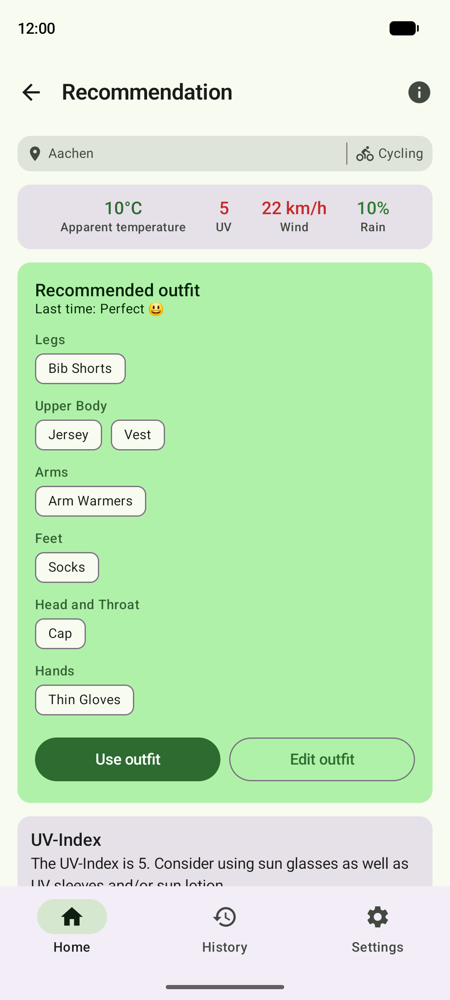
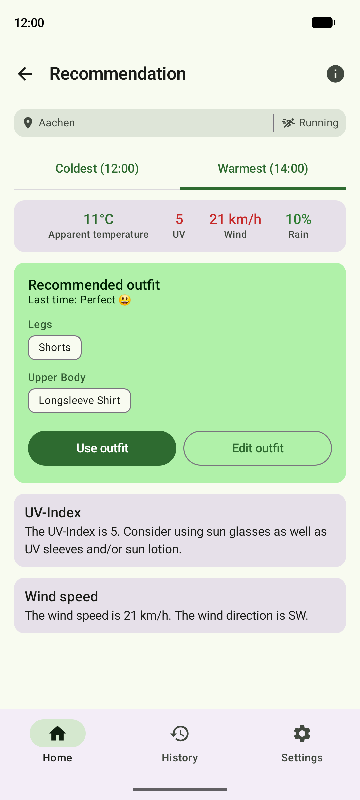
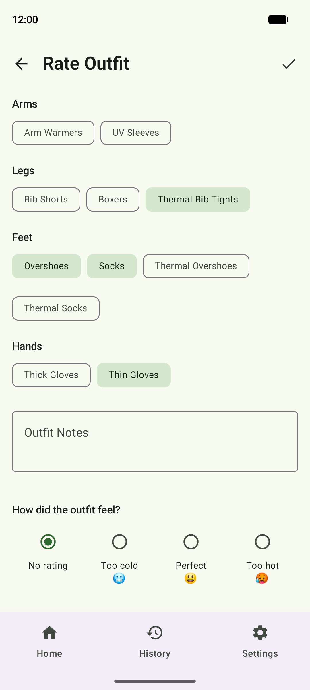
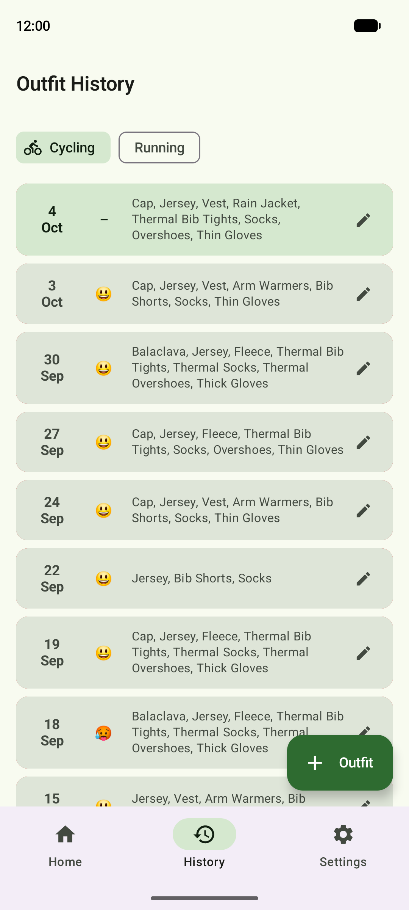
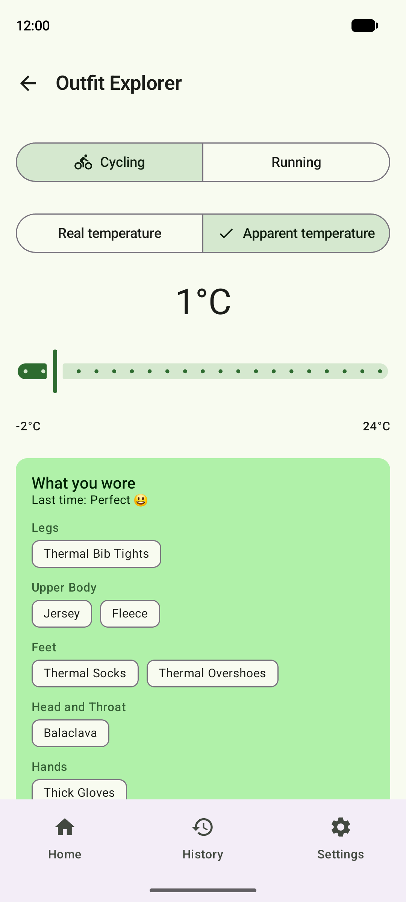

# Perfect Outfit

What to wear for your ride or run — from the forecast and the outfits you've rated.

<table>
  <tr>
    <td></td>
    <td></td>
    <td></td>
    <td></td>
    <td></td>
  </tr>
</table>

- **Recommends** an outfit from the hourly forecast at your location — no API key, via Open-Meteo
- **Plans** a workout window: what to wear for its coldest and warmest hour
- **Rates** each outfit too cold, perfect or too hot, with a reminder after your workout
- **Learns** from your ratings: matches the closest temperatures you've rated
- **Explores** your history temperature by temperature
- **Cycling and running**, each with its own editable clothing catalog
- **Backs up** daily to Google Drive, or export and import a JSON file

Screenshots use generated demo outfits and a synthetic forecast for Aachen at noon;
regenerate with `./gradlew readmeScreenshots` (needs a running emulator; wipes the app's data on it).

## Build

Android 8.0+ (API 26), Android Studio, JDK 17. Clone, open, run.
Google Drive backup needs an OAuth client ID as `drive.oauth.client.id` in `local.properties`;
everything else works without it.

Built with Kotlin, Jetpack Compose, Room, Hilt, WorkManager and Retrofit.
Developed with [Claude Code](https://claude.ai/code).
